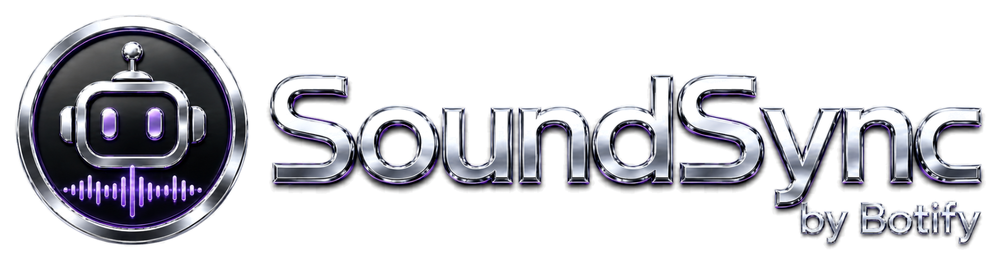

# SoundSync

<p align="center">
  
</p>

**SoundSync by Botify** — Windows Electron tray app that auto-syncs SoundCloud likes and playlists to a local folder using **yt-dlp** + **ffmpeg**.

> Previously released as *SoundCloud Auto Sync / SC Auto Downloader*. Rebranded to **SoundSync** in v2.0.6.

**Current version:** v2.0.6

## What it does

- Runs in the system tray; no foreground window required.
- Monitors a list of SoundCloud usernames (their public likes) and playlist URLs.
- On an interval, fetches new tracks and downloads them as MP3 with embedded metadata + artwork.
- One-off "Download URL..." entry point for any SoundCloud track or playlist.
- Tray menu surfaces status (Syncing / Idle / Error), last-sync time, and download count.
- Auto-update via GitHub Releases through `electron-updater` (configurable — see below).

## Install / update

Install via the released NSIS installer published on GitHub:

- Releases: https://github.com/HIGH-TEXAS-LIST/sc-auto-downloader/releases
- Current release: [v2.0.6](https://github.com/HIGH-TEXAS-LIST/sc-auto-downloader/releases/tag/v2.0.6)

### Important — auto-updater artifact requirement

`electron-updater` only detects an update when the GitHub Release for the target version has the **packaged installer + metadata** attached. Specifically:

- `SoundSync Setup <version>.exe` (the NSIS installer produced by `electron-builder`)
- `latest.yml` (the manifest `electron-updater` reads)

A notes-only release (tag + body, no binaries) **will not be detected** by installed clients. To publish a real update:

1. Bump version (handled automatically by `prebuild`).
2. Run `npm run build:win` — produces `dist/*.exe` and `dist/latest.yml`.
3. Upload both to the release:
   `gh release upload v<version> "dist/SoundSync Setup <version>.exe" dist/latest.yml`

## Basic usage

1. Launch the app (it minimizes to the tray; double-click the tray icon to open Settings).
2. **Downloads** page → choose a download folder.
3. **Monitoring** page → add SoundCloud usernames (their `/likes` are followed) and/or full playlist URLs (must contain `/sets/`).
4. Toggle **Auto-sync on launch** in **Startup** to begin monitoring immediately on app start.
5. Set **Sync interval** (default 15 min).
6. **Sync Now** from the tray menu or footer button forces an immediate sync.

## Update controls

Settings → Startup / App Updates card:

| Setting | Default | Effect |
|---|---|---|
| **Check for updates automatically** | on | Startup check + background download via `electron-updater` |
| **Install updates on next restart** | on | Apply downloaded update silently when app quits. Off = wait for explicit "Install now" |
| **Check for updates** (button) | n/a | Manual on-demand check; works regardless of the auto-check toggle |
| **Install now** (button) | n/a | Triggers `quitAndInstall()` when a downloaded update is pending |

Update errors surface as tray balloons.

## Security / hardening highlights

- **Renderer XSS fix** — settings UI never injects user-supplied usernames / playlist URLs / titles via `innerHTML`. All list-item construction uses `createElement` + `textContent`.
- **Safer process execution** — main-process diagnostics and `fetch-playlist-metadata` (which receives a user-controlled URL) do not shell-interpolate. All `yt-dlp` and `ffmpeg` invocations use argv arrays via `spawn` / `execFile`.
- **CLI hardening** — `cli.js` shell-interpolated calls converted to `execFileSync` with argv arrays.
- **Rate-limit / network hardening** — every `yt-dlp` call passes:
  - `--retries 10` with `--retry-sleep http:exp=1:30` (exponential backoff up to 30 s) and `--retry-sleep extractor:5`
  - `--socket-timeout 30`
  - `--sleep-requests 1` (and `--sleep-interval 2 --max-sleep-interval 6` for downloads)
  - Per-track 1.5 s pacing in `getFullMetadata`
  - 3-attempt app-level retry with 15 s / 30 s / 60 s backoff on detected rate-limit
  - 90 s download-queue cooldown when a 429 is detected mid-batch
- **Configurable auto-updater** — checks, downloads, and install-on-quit can each be disabled.

## Developer commands

### Run from source

```bash
npm install
npm start                  # launches Electron pointing at src/main.js
```

Requires `yt-dlp` and `ffmpeg` either bundled in `resources/` (preferred — picked up by `getYtDlpPath()` / `getFfmpegPath()`) or on `PATH`.

### Syntax checks (no test suite yet)

```bash
node --check src/main.js
node --check src/preload.js
node --check cli.js
node --check src/services/downloader.js
node --check src/services/soundcloud-monitor.js
```

### Build (Windows installer)

```bash
npm run build:win
```

Notes:

- `prebuild`/`prebuild:win` automatically run `scripts/bump-version.js` (patch bump) — running a build mutates `package.json` and `src/settings.html` version display. To build without bumping, run `electron-builder --win` directly.
- Output goes to `dist/`. The NSIS installer + `latest.yml` from there are what need to be uploaded to the GitHub Release for the auto-updater to detect the new version.

### Version bump (manual)

```bash
npm run bump            # patch:  2.0.6 → 2.0.7
npm run bump:minor      # minor:  2.0.6 → 2.1.0
npm run bump:major      # major:  2.0.6 → 3.0.0
```

### CLI

`cli.js` provides a console interface independent of the Electron app:

```bash
node cli.js test        # diagnostics
node cli.js config      # interactive configure
node cli.js settings    # show current config
node cli.js sync        # run a sync now
node cli.js install     # install deps + check bundled tools
node cli.js gui         # launch the Electron app
```

Note: the CLI maintains its own config at `%APPDATA%\soundsync\config.json` (separate from the Electron app's `electron-store`). It will read the legacy `%APPDATA%\soundcloud-auto-sync\config.json` if the new path doesn't exist yet, so upgrading from prior versions preserves CLI settings. The CLI's `sync` path does not yet share the rate-limit hardening that the Electron sync uses.

## Brand assets

Premium transparent branding lives in [`assets/brand/`](assets/brand):

- `SoundSync_logo_transparent_1024.png` — square logo
- `SoundSync_transparent_banner_2048x682.png` / `_trimmed.png` — header / about banner
- `SoundSync_taskbar_icon.ico` / `_512.png` / `_256.png` — app + taskbar / installer icon
- `SoundSync_banner_preview_dark.png` — preview composite (not for use as a source asset)

## License

MIT (see `package.json`).
